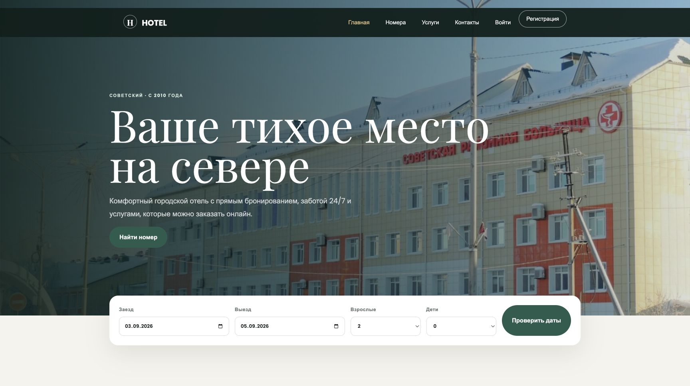
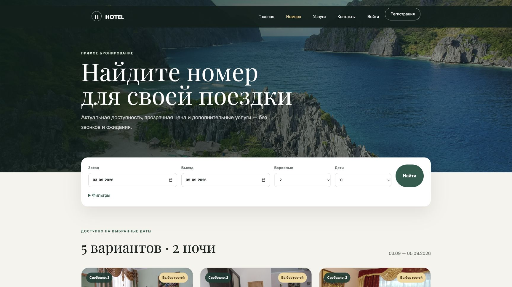
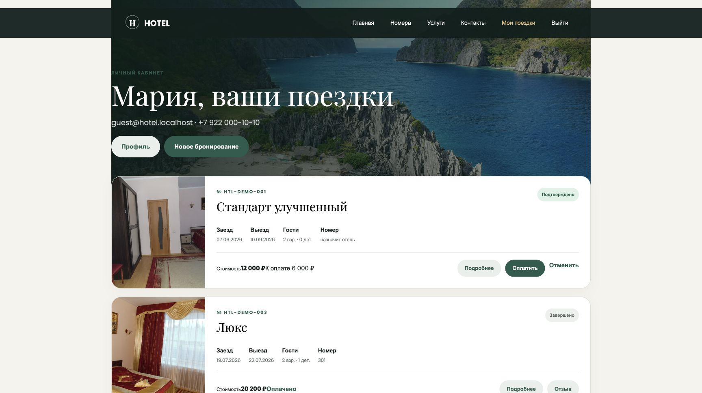
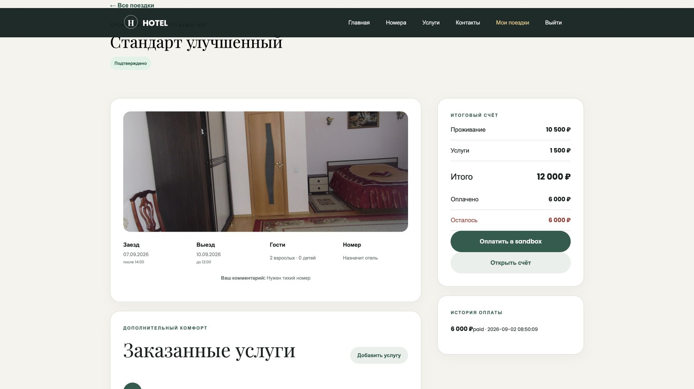
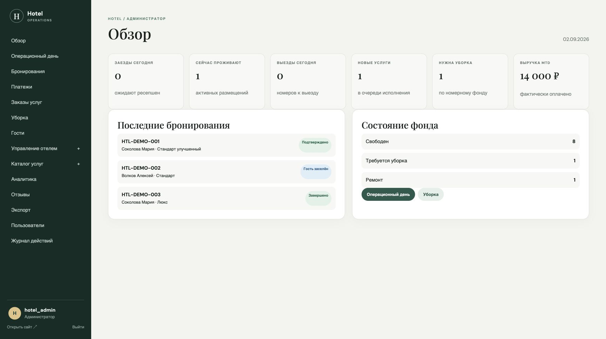
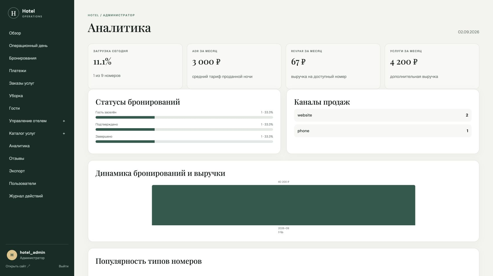
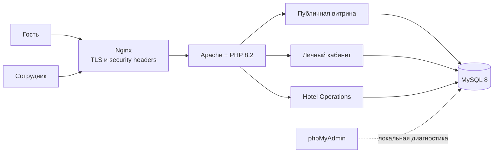
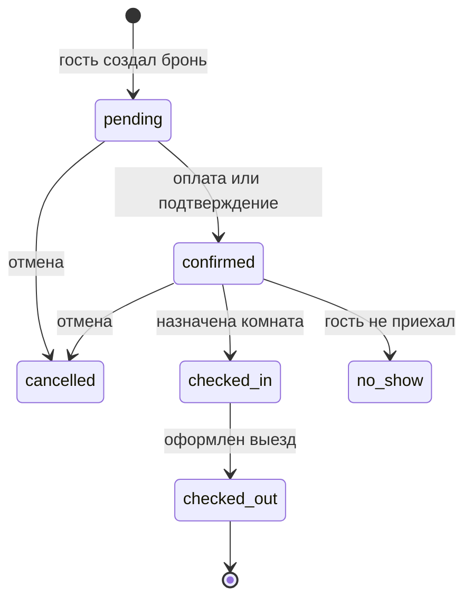

<p align="center">
  <strong>Учебный проект: информационная система управления небольшим отелем</strong><br>
  Публичная витрина, онлайн-бронирование, личный кабинет и PMS в одном приложении
</p>

<p align="center">
  
</p>

<h1 align="center">Hotel Website</h1>

<p align="center">
  Полноценный демонстрационный продукт на PHP 8.2 и MySQL<br>
  с шестью ролями, дополнительными услугами, оплатой, аналитикой и экспортом в Excel
</p>

<p align="center">
  <a href="docs/README.md">Документация</a> ·
  <a href="#интерфейс">Интерфейс</a> ·
  <a href="docs/architecture.md">Архитектура</a> ·
  <a href="docs/user-guide.md">Гостевой контур</a> ·
  <a href="docs/admin-guide.md">Работа сотрудников</a> ·
  <a href="docs/database.md">База данных</a> ·
  <a href="docs/security.md">Безопасность</a> ·
  <a href="docs/demo.md">Сценарий демонстрации</a>
</p>


## О проекте

Hotel Website — единый цифровой контур небольшого отеля. Гость выбирает даты и
номер, создаёт аккаунт, бронирует проживание, заказывает услуги и оплачивает их в
демонстрационном эквайринге. Сотрудники ведут клиента от подтверждения брони до
выезда, управляют номерным фондом, уборкой, услугами и получают управленческую
аналитику.

**Назначение:** курсовая работа, портфолио, демонстрационный стенд и основа пилотного внедрения<br>
**Основная ветка:** `main` — всегда готовая к запуску версия<br>
**Статус:** функционально завершённый product MVP с воспроизводимым Docker-окружением

Интерфейс построен как гостиничный продукт, а не набор учебных таблиц: публичная
часть, кабинет гостя и Hotel Operations имеют разные сценарии, навигацию и права,
но работают с одной согласованной доменной моделью.

## Интерфейс

Все изображения ниже сняты с реального Docker-стенда и демонстрационной базы.
Они показывают сквозной путь гостя и ежедневный рабочий контур сотрудников.

<table>
  <tr>
    <td width="50%">
      <strong>Главная страница</strong><br>
      Витрина отеля и быстрый поиск по датам.<br><br>
      
    </td>
    <td width="50%">
      <strong>Каталог номеров</strong><br>
      Доступность, фильтры и прозрачный расчёт проживания.<br><br>
      
    </td>
  </tr>
  <tr>
    <td width="50%">
      <strong>Личный кабинет</strong><br>
      Активные и завершённые поездки гостя.<br><br>
      
    </td>
    <td width="50%">
      <strong>Карточка бронирования</strong><br>
      Проживание, услуги, оплаты и итоговый счёт.<br><br>
      
    </td>
  </tr>
  <tr>
    <td width="50%">
      <strong>Hotel Operations</strong><br>
      Операционные показатели, брони и состояние фонда.<br><br>
      
    </td>
    <td width="50%">
      <strong>Аналитика</strong><br>
      Загрузка, ADR, RevPAR, каналы и динамика выручки.<br><br>
      
    </td>
  </tr>
</table>

## Пользовательские контуры

| Контур | Для кого | Основные задачи |
| --- | --- | --- |
| Публичный сайт | посетитель | изучить номера и услуги, проверить доступность, перейти к бронированию |
| Личный кабинет | гость | управлять поездками, оплатой, услугами, счётом, профилем и отзывом |
| Hotel Operations | сотрудники | продажи, заселение, выезд, уборка, справочники, аналитика и экспорт |
| phpMyAdmin | разработчик | локальная диагностика схемы и демонстрационных данных |

## Возможности

- адаптивная главная страница с данными из MySQL;
- каталог типов номеров с фильтрами по датам, гостям, категории и цене;
- расчёт фактической доступности по физическому номерному фонду;
- регистрация, вход, выход, восстановление пароля и профиль гостя;
- защита бронирования от пересечений и повторная проверка внутри транзакции;
- автоматический расчёт проживания, дополнительных услуг, скидки и итога;
- четыре способа тарификации услуг: за заказ, сутки, гостя или единицу;
- дозаказ услуг из личного кабинета и очередь исполнения для сотрудников;
- sandbox-оплата с успешным и отклонённым сценарием без списания денег;
- история поездок, детализация брони, счёт и отзыв после проживания;
- отмена гостем допустимой брони с демонстрационным возвратом платежа;
- управление клиентами, сотрудниками, аккаунтами, номерами и справочниками;
- полный цикл `pending → confirmed → checked_in → checked_out`;
- автоматическая постановка номера на уборку после выезда;
- доска хаускипинга со статусами, приоритетом и назначением исполнителя;
- модерация отзывов и прикладная история действий;
- KPI загрузки, ADR, RevPAR, выручки, каналов и популярных типов номеров;
- выгрузка шести реестров в настоящий `.xlsx` с фильтром и закреплённой шапкой;
- насыщенные демонстрационные данные для сквозного показа системы.

## Административная панель

Hotel Operations доступен по `/admin/` и проверяет права на сервере для каждого
рабочего раздела. Панель не ограничивается CRUD: в ней есть операционный день,
назначение физической комнаты, заселение и выезд, очередь услуг, housekeeping,
платежи, отзывы, аналитика и аудит.

Основные рабочие зоны:

- dashboard с текущими показателями и быстрыми действиями;
- бронирования и отдельная расширенная карточка;
- операционный день ресепшена;
- клиенты, сотрудники и пользовательские аккаунты;
- типы номеров, физические комнаты, этажи, виды и санузлы;
- категории и каталог дополнительных услуг;
- заказы услуг, платежи, уборка и отзывы;
- аналитика и центр XLSX-экспортов;
- журнал административных и пользовательских действий.

Подробные сценарии и допустимые переходы описаны в
[руководстве сотрудников](docs/admin-guide.md).

## Технологии

### Backend

- PHP 8.2 с `declare(strict_types=1)`;
- PDO и только подготовленные SQL-запросы для пользовательских значений;
- собственные сервисы доступности, бронирования и XLSX;
- сессионная авторизация и RBAC без тяжёлого фреймворка;
- MySQL 8.0, InnoDB, внешние ключи, индексы и ограничения `CHECK`.

### Frontend

- серверные PHP-шаблоны;
- HTML5, CSS3 и vanilla JavaScript;
- Bootstrap-компоненты исходной темы;
- отдельный адаптивный слой публичного сайта и Hotel Operations;
- клиентский перерасчёт корзины услуг с обязательной серверной проверкой.

### Инфраструктура

- Docker Compose;
- Nginx как reverse proxy и TLS-терминатор;
- Apache + PHP в отдельном контейнере;
- MySQL в persistent volume;
- phpMyAdmin только для локальной разработки;
- GitHub Actions, Composer, PHPStan и PHP-CS-Fixer.

## Архитектура



Проект остаётся единым deployable-монолитом, но бизнес-ответственность разделена:

| Слой | Ответственность |
| --- | --- |
| `public/` | HTTP endpoints публичного сайта, кабинета и панели |
| `templates/` | общая оболочка интерфейсов и навигация |
| `src/Security` | авторизация, роли и проверка разрешений |
| `src/Service` | доступность, бронирование, суммы и XLSX |
| `src/Repository` | безопасный универсальный CRUD для справочников |
| `src/Support` | валидация, CSRF, flash, escaping, аудит и форматирование |
| `database/` | baseline-схема, ограничения и demo-seed |
| `deploy/` | PHP, Nginx, TLS и phpMyAdmin |

Полная схема компонентов и связей приведена в
[документе об архитектуре](docs/architecture.md).

## Жизненный цикл бронирования



После выезда физическая комната получает статус `dirty`, а система создаёт задачу
уборки. Завершение задачи возвращает комнату в `available`. Эта последовательность
сохраняет согласованность брони, номера и housekeeping.

## Ролевая модель

| Роль | Назначение и доступ |
| --- | --- |
| `guest` | личный кабинет, собственные брони, услуги, платежи, профиль и отзывы |
| `reception` | клиенты, бронирования, операционный день, платежи и очередь услуг |
| `housekeeping` | доска уборки, принятие и завершение задач |
| `analyst` | dashboard, аналитика и XLSX-экспорт без изменения операционных данных |
| `manager` | все рабочие контуры, справочники, отчёты и управление персоналом |
| `admin` | полный доступ, включая учётные записи и системные справочники |

Матрица разрешений находится в `src/Security/Auth.php`; скрытие пункта меню не
используется как средство защиты — каждый endpoint повторно проверяет разрешение.

## Быстрый запуск

### Требования

- Docker;
- Docker Compose v2.

### 1. Подготовить окружение

```bash
cp .env.example .env
```

Для общего локального стенда замените пароли MySQL и администратора в `.env`.
Файл `.env` исключён из Git и публиковаться не должен.

### 2. Запустить проект

```bash
docker compose up -d --build
```

После запуска доступны:

- сайт — <https://localhost/>;
- Hotel Operations — <https://localhost/admin/>;
- phpMyAdmin — <http://localhost:8081/>.

Порты задаются через `HOTEL_HTTP_PORT`, `HOTEL_HTTPS_PORT` и `HOTEL_PMA_PORT`.
Подробности, обновление и восстановление описаны в
[руководстве по развёртыванию](docs/deployment.md).

## Демо-доступы

| Контур | Логин | Пароль |
| --- | --- | --- |
| Гость | `guest@hotel.localhost` | `GuestDemo2024` |
| Администратор | `hotel_admin` | `HotelDemo2024` |
| Менеджер | `manager` | `StaffDemo2024` |
| Ресепшен | `reception` | `StaffDemo2024` |
| Хаускипинг | `housekeeping` | `StaffDemo2024` |

Эти учётные записи и пароли предназначены только для локальной демонстрации.

## Проверки

```bash
docker compose run --rm --no-deps web composer validate --strict
docker compose run --rm --no-deps web composer install --no-interaction --prefer-dist
docker compose run --rm --no-deps web composer check
BASE_URL=https://localhost ./scripts/smoke.sh
docker compose config --quiet
```

`composer check` выполняет синтаксическую проверку, PHPStan и PHP-CS-Fixer.
Smoke-тест проверяет публичные страницы и вход в оба защищённых контура. Полный
приёмочный чек-лист приведён в [docs/testing.md](docs/testing.md).

## Структура

```text
.
├── config/                         # bootstrap, окружение и сессии
├── database/
│   ├── init.sql                    # полная схема и demo-seed
│   └── migrations/                 # правила версионных изменений
├── deploy/
│   ├── docker/                     # PHP/Apache image
│   ├── nginx/                      # reverse proxy и локальный TLS
│   └── phpmyadmin/                 # безопасная локальная конфигурация
├── docs/                           # комплект проектной документации
├── public/
│   ├── account/                    # личный кабинет гостя
│   ├── admin/                      # Hotel Operations
│   ├── css/                        # стили приложения и темы
│   └── js/                         # клиентские сценарии
├── scripts/                        # запуск и smoke-тест
├── src/
│   ├── Config/                     # загрузка переменных окружения
│   ├── Repository/                 # доступ к данным
│   ├── Security/                   # Auth и RBAC
│   ├── Service/                    # доменные сервисы
│   └── Support/                    # общие безопасные помощники
├── templates/                      # шаблоны публичного сайта и панели
├── compose.yaml
└── composer.json
```

## Конфигурация

| Переменная | Назначение | Значение по умолчанию |
| --- | --- | --- |
| `DB_HOST` | имя сервиса или хост MySQL | `db` |
| `DB_NAME` | база приложения | `hotel` |
| `DB_USER` | пользователь приложения | `hotel` |
| `DB_PASS` | пароль пользователя | `hotel` |
| `DB_ROOT_PASS` | root-пароль локального MySQL | `root` |
| `HOTEL_HTTP_PORT` | внешний HTTP-порт | `80` |
| `HOTEL_HTTPS_PORT` | внешний HTTPS-порт | `443` |
| `HOTEL_PMA_PORT` | локальный порт phpMyAdmin | `8081` |

В production нельзя использовать демонстрационные значения. Требования к секретам,
TLS, резервному копированию и внешним интеграциям перечислены в
[docs/deployment.md](docs/deployment.md) и [docs/security.md](docs/security.md).

## Безопасность

- пароли сохраняются только через `password_hash()`;
- session ID меняется при входе и выходе;
- cookie получают `HttpOnly`, `SameSite=Lax` и `Secure` при HTTPS;
- все изменяющие формы защищены CSRF-токеном;
- роли и разрешения проверяются на сервере;
- пользовательский вывод проходит HTML escaping;
- SQL-значения передаются через параметры PDO;
- критичные операции бронирования и оплаты выполняются транзакционно;
- IP в журнале аудита хранится как SHA-256, а не в открытом виде;
- Nginx добавляет `X-Content-Type-Options`, `X-Frame-Options`,
  `Referrer-Policy` и `Permissions-Policy`;
- токены восстановления одноразовые и ограничены по времени.

Текущая реализация и production-чек-лист подробно разобраны в
[документе о безопасности](docs/security.md).

## Покрытие требований курсовой

| Согласованное требование | Реализация |
| --- | --- |
| PHP + HTML/CSS/JS + MySQL | основной стек проекта |
| регистрация и авторизация | гостевой и служебный контур, восстановление доступа |
| пользовательская и административная часть | три интерфейса и шесть ролей |
| просмотр и управление данными БД | списки, связи, формы, фильтры и CRUD |
| клиенты и заселение | карточки гостей, назначение комнаты, check-in/check-out |
| апартаменты и персонал | типы, физический фонд, сотрудники и аккаунты |
| бронирование с итоговой суммой | доступность, защита от пересечений, услуги и скидки |
| приобретение дополнительных услуг | каталог, корзина, дозаказ, оплата и очередь |
| аналитика | загрузка, ADR, RevPAR, выручка, каналы и популярность |
| экспорт в Excel | шесть реестров в формате `.xlsx` |

Расширенная матрица и границы MVP находятся в [docs/product.md](docs/product.md).

## Комплект документации

| Документ | Для кого |
| --- | --- |
| [Навигатор](docs/README.md) | состав комплекта и порядок чтения |
| [Архитектура](docs/architecture.md) | разработчик и преподаватель |
| [Руководство гостя](docs/user-guide.md) | пользователь и демонстратор |
| [Руководство сотрудников](docs/admin-guide.md) | ресепшен, менеджер, хаускипинг, администратор |
| [База данных](docs/database.md) | разработчик и администратор БД |
| [Развёртывание](docs/deployment.md) | разработчик и системный администратор |
| [Безопасность](docs/security.md) | разработчик и принимающая сторона |
| [Тестирование](docs/testing.md) | разработчик и комиссия |
| [Сценарий демонстрации](docs/demo.md) | защита курсовой и показ продукта |
| [Разработка](docs/development.md) | участник проекта |
| [Функциональность и roadmap](docs/product.md) | владелец продукта |

## Граница демонстрационного MVP

Система готова для курсовой, портфолио и продуктовой демонстрации. Перед обработкой
реальных гостей необходимо подключить боевой эквайринг и уведомления, заменить
правовые тексты реквизитами оператора, настроить production TLS, секреты,
резервные копии, мониторинг, миграции и провести отдельную security-приёмку.

## Права

Проект проприетарный. Исходный код, фотографии, тексты и демонстрационные данные
не предназначены для распространения без разрешения правообладателя.
