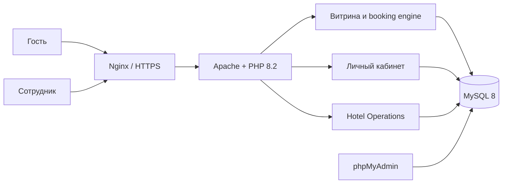
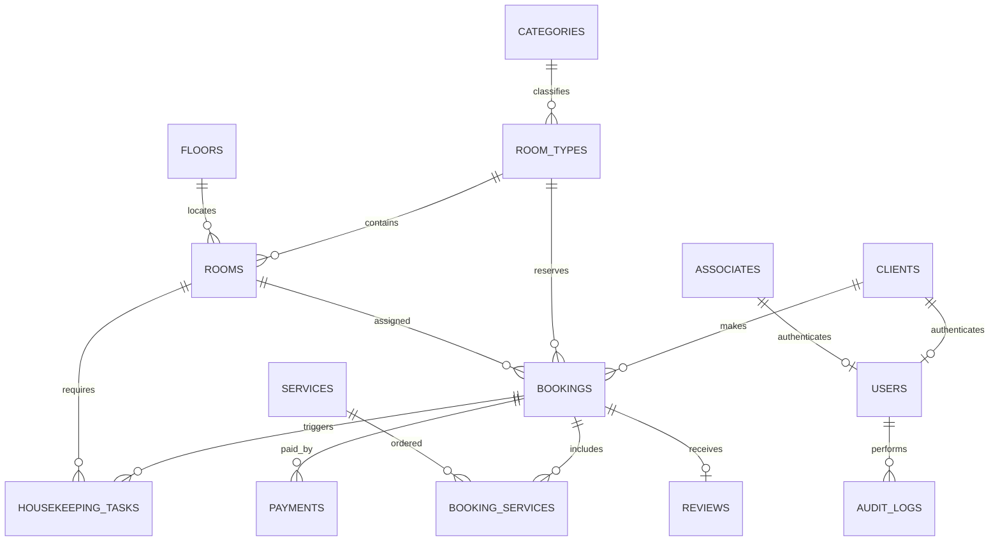
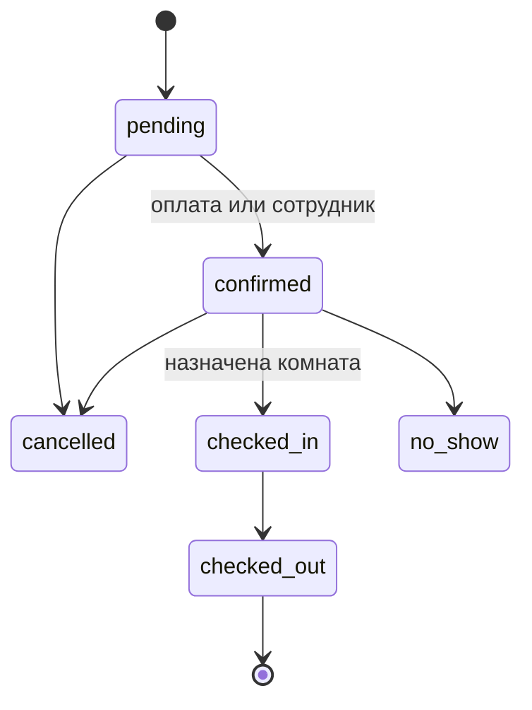

# Архитектура Hotel Website

## Контуры системы

Hotel — серверный PHP-монолит с общей доменной моделью и тремя интерфейсами.

- витрина показывает контент из БД и выполняет поиск доступности;
- кабинет гостя управляет бронированиями, услугами, платежами и отзывами;
- Hotel Operations обслуживает продажи, ресепшен, уборку, аналитику и справочники.

## Слои

| Путь | Ответственность |
| --- | --- |
| `public/` | HTTP endpoints и статические assets |
| `templates/` | общая оболочка сайта и панели |
| `src/Security` | сессионная авторизация и RBAC |
| `src/Service` | доступность, бронирования и XLSX |
| `src/Repository` | allowlist CRUD для справочников |
| `src/Support` | CSRF, escaping, flash, аудит и форматирование |
| `database/init.sql` | baseline-схема и демонстрационные данные |
| `deploy/` | воспроизводимый контейнерный runtime |

## Модель данных

`room_types` — продаваемый тариф/категория, `rooms` — конкретные физические комнаты. Такое разделение позволяет одновременно продавать несколько одинаковых номеров и назначать комнату ближе к заселению.

## Жизненный цикл брони

После `checked_out` комната становится `dirty`, создаётся задача уборки. После завершения задачи комната возвращается в `available`.

## Расчёт доступности

Доступность типа номера равна числу активных физических комнат за вычетом пересекающихся броней в статусах `pending`, `confirmed`, `checked_in`. Проверка повторяется внутри транзакции перед созданием брони. Границы интервалов полуоткрытые: выезд одной брони в день заезда следующей не считается пересечением.

## Безопасность

- роли и разрешения проверяются сервером;
- пароли сохраняются через `password_hash()`;
- session ID обновляется при входе/выходе;
- cookie — `HttpOnly`, `SameSite=Lax`, `Secure` на HTTPS;
- все изменяющие формы используют CSRF;
- SQL-значения передаются параметрами PDO;
- пользовательский вывод проходит HTML escaping;
- административные и пользовательские действия пишутся в audit log;
- Nginx добавляет базовые browser security headers;
- токены восстановления одноразовые и живут 30 минут.

## Инфраструктура

| Сервис | Назначение | Публикация |
| --- | --- | --- |
| `nginx` | reverse proxy и локальный TLS | 80 / 443 |
| `web` | Apache + PHP 8.2, PDO, Zip | внутренняя сеть |
| `db` | MySQL 8 | внутренняя сеть |
| `phpmyadmin` | локальная диагностика | 8081 |

MySQL хранится в volume. Новая установка получает schema baseline и demo-seed из `database/init.sql`.
