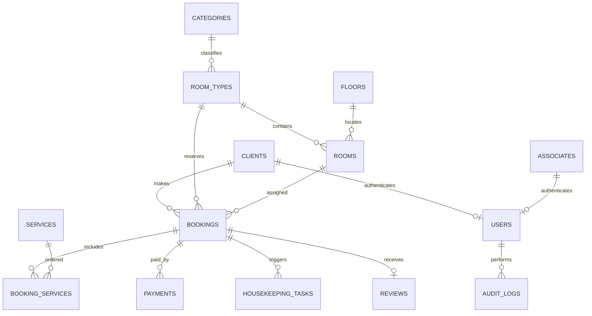

# База данных

## Общие принципы

Hotel Website использует MySQL 8.0, InnoDB и `utf8mb4_unicode_ci`. Baseline-схема
новой установки находится в `database/init.sql`. Она создаёт таблицы, ограничения,
индексы и демонстрационные данные.

## Группы таблиц

### Номерной фонд

| Таблица | Назначение |
| --- | --- |
| `categories` | маркетинговая категория номера |
| `room_views` | вид из окна |
| `bathroom_types` | тип санузла |
| `floors` | этаж и числовой уровень сортировки |
| `room_types` | продаваемый тип, вместимость, цена и описание |
| `rooms` | физическая комната и эксплуатационный статус |

### Пользователи

| Таблица | Назначение |
| --- | --- |
| `clients` | карточка гостя, контакты и предпочтения |
| `associates` | карточка сотрудника и должность |
| `users` | логин, хеш пароля, роль и ссылка на профиль |
| `password_reset_tokens` | одноразовые хеши токенов восстановления |

Один пользователь связывается либо с клиентом, либо с сотрудником. Уникальные
индексы предотвращают несколько аккаунтов для одной карточки.

### Продажи и обслуживание

| Таблица | Назначение |
| --- | --- |
| `bookings` | даты, статус, гость, размещение и денежные итоги |
| `service_categories` | группы дополнительных услуг |
| `services` | каталог, цена и способ тарификации |
| `booking_services` | заказ услуги в рамках конкретной брони |
| `payments` | попытки оплаты и возвраты |
| `reviews` | отзыв по завершённому проживанию |

Цена услуги копируется в `booking_services.unit_price` в момент заказа. Поэтому
последующее изменение каталога не переписывает финансовую историю существующей
брони.

### Операции и аудит

| Таблица | Назначение |
| --- | --- |
| `housekeeping_tasks` | уборка, инспекция или ремонт комнаты |
| `audit_logs` | пользователь, действие, сущность, payload и хеш IP |
| `schema_migrations` | применённая версия baseline/миграции |

## Ключевые связи

## Денежные поля

Все суммы хранятся как `DECIMAL(10,2)`:

- `accommodation_total` — проживание до скидки;
- `services_total` — сумма неотменённых услуг;
- `discount_total` — скидка сотрудника;
- `total` — `max(0, accommodation + services - discount)`.

Для отчётности нельзя пересчитывать историческую бронь только по текущему прайсу.

## Доступность

Активными для пересечения считаются `pending`, `confirmed`, `checked_in`. Интервал
полуоткрытый: `[date_in, date_out)`. Две брони конфликтуют, если одна не завершилась
до начала другой и не начинается после её окончания.

Проверка типа номера сравнивает число продаваемых физических комнат с количеством
пересекающихся активных броней. При создании брони строки фонда блокируются внутри
транзакции, чтобы снизить риск двойной продажи.

## Ограничения и индексы

- уникальны коды брони, логины, email и номера комнат;
- внешние ключи защищают связанные справочники от удаления;
- `CHECK` запрещает отрицательные суммы, неверные флаги и обратные даты;
- составные индексы по типу, статусу и датам ускоряют поиск пересечений;
- каскадное удаление используется только для зависимостей, не имеющих смысла без
  родителя, например заказа услуги или отзыва.

## Demo-seed

Seed создаёт справочники, физические комнаты, клиентов, сотрудников, аккаунты,
брони разных статусов, услуги, платежи, уборку и отзыв. Он предназначен для
демонстрации, а не для production.

## Изменение схемы

`init.sql` применяется Docker только к пустому volume. Для существующей базы:

1. создать отдельный идемпотентный SQL-файл в `database/migrations/`;
2. выполнить backup;
3. проверить миграцию на копии данных;
4. применить её один раз;
5. записать версию в `schema_migrations`;
6. обновить baseline, ER-схему и этот документ.

Удаление пользовательских данных не включается в миграцию без отдельного решения.
